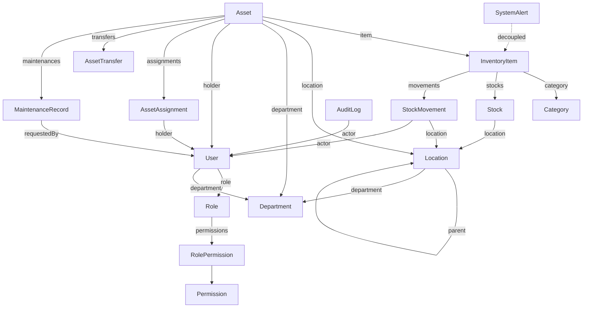

# 03-domain-model.md — Domain Model
# BPTI Inventory & Asset Management System

**Snapshot diaudit:** v2 (`bpti-project-main__2_.zip`, 2026-09-24) — lihat `README.md` §1
**Sumber utama:** `prisma/schema.prisma` (471 baris, 19 model, 9 enum)
**Legenda status:** lihat `README.md` §2

---

## 0. Konteks sistem (Context Map — Blueprint #06)

Sistem ini **tidak memiliki integrasi eksternal** pada snapshot v2 `[VERIFIED-IN-CODE]`: tidak ada SDK email, tidak ada object-storage client, tidak ada API pihak ketiga yang di-*fetch*. Satu-satunya batas sistem adalah:

```text
                     Pengguna BPTI (browser)
                             │ HTTPS
                             ▼
                 ┌───────────────────────┐
                 │   BPTI Inventory &     │
                 │   Asset Mgmt System    │◄── satu deployable, satu database
                 └───────────┬───────────┘
                             │
                             ▼
                       MySQL 8.4 (bpti_db)
```

Tidak ada dependensi keluar (mail server, object storage, endpoint monitoring perangkat, sistem HRIS/legacy). Ini konsisten dengan `SRS.md` §7 "Out of Scope by Default" dan `AGENTS.md` §62 "No Premature Infrastructure". Begitu `FR-NOTIFY` (notifikasi) atau `FR-ATTACH` (lampiran file) disetujui, context map ini **wajib** diperbarui untuk memasukkan mail/storage provider sebagai aktor eksternal baru.

## 1. Bounded context / modul domain

Tujuh modul berikut diverifikasi langsung dari struktur direktori `src/modules/*` dan konfirmasi "nol import lintas-modul" (`README.md` Temuan #8):

| Modul | Memiliki (model Prisma) | File implementasi |
|---|---|---|
| **Identity & Access** | `User`, `Session`, `Account`, `Verification`, `Role`, `Permission`, `RolePermission`, `Department` | `lib/auth.ts`, `lib/rbac.ts`, `lib/session.ts`, `modules/users/user-service.ts` |
| **Locations** | `Location` (pohon hierarkis, self-relation) | `modules/locations/location-service.ts` |
| **Inventory** | `Category`, `InventoryItem`, `Stock`, `StockMovement` | `modules/inventory/inventory-service.ts` |
| **Assets** | `Asset`, `AssetAssignment`, `AssetTransfer` | `modules/assets/asset-service.ts` |
| **Maintenance** | `MaintenanceRecord` | `modules/maintenance/maintenance-service.ts` |
| **Monitoring** | *(tanpa model sendiri — agregasi read-only lintas modul)* | `modules/monitoring/monitoring-service.ts` |
| **Reporting** | *(tanpa model sendiri — agregasi read-only lintas modul)* | `modules/reports/report-service.ts` |
| **Audit** | `AuditLog`, `SystemAlert` | `lib/audit.ts` — **catatan:** `app/audit/page.tsx` memanggil `prisma.auditLog.findMany()` langsung, bukan lewat service layer khusus Audit. Ini satu-satunya pelanggaran batas modul yang ditemukan (lihat `13-module-boundaries.md` §4). |

Catatan penamaan: `Department` secara teknis milik Identity & Access di schema (relasi ke `User`), tapi juga direferensikan `Location` dan `Asset` — ini organizational unit lintas-domain yang wajar, bukan pelanggaran batas.

## 2. Agregat inti dan invariant

### 2.1 Inventory Item (agregat kuantitas)

```text
InventoryItem (root)
  ├── Category (many-to-one)
  ├── Stock[]        — satu baris per (item, location)
  └── StockMovement[] — ledger historis, append-only
```

- **Invariant I-1** `[VERIFIED-IN-CODE]`: `Stock` unik per `(itemId, locationId)` — `@@unique([itemId, locationId])` (`schema.prisma:222`). Tidak mungkin ada dua baris stok untuk item+lokasi yang sama.
- **Invariant I-2** `[VERIFIED-IN-CODE]`: `quantity` pada `Stock` **tidak pernah ditulis langsung** oleh UI/actor — satu-satunya jalur penulisan adalah `InventoryService.transactStock()` (`inventory-service.ts:110-210`), yang selalu menulis `StockMovement` di transaksi yang sama. Field `Stock.quantity` secara semantik adalah *derived state* dari ledger `StockMovement`, bukan sumber kebenaran independen.
- **Invariant I-3** `[VERIFIED-IN-CODE]`: `Stock.reservedQty` ada di schema (`schema.prisma:219`) tapi **tidak pernah dibaca atau ditulis** oleh kode manapun — field mati (dead field), kemungkinan disiapkan untuk fitur reservasi yang belum diimplementasikan.
- Padanan SRS: `FR-STOCK-*`, `FR-MOVE-*`, `BR-003`.

### 2.2 Asset (agregat individual)

```text
Asset (root)
  ├── InventoryItem?  (opsional — aset boleh tidak terkait item katalog)
  ├── Location?
  ├── Department?
  ├── User? (holder saat ini — "AssetCurrentHolder")
  ├── AssetAssignment[]  — riwayat penugasan
  ├── AssetTransfer[]    — riwayat mutasi lokasi/pemegang
  └── MaintenanceRecord[]
```

- **Invariant I-4** `[VERIFIED-IN-CODE]`: `assetTag` dan `serialNumber` unik global (`schema.prisma:283-284`).
- **Invariant I-5** `[VERIFIED-IN-CODE]`: status Asset harus mengikuti `LEGAL_TRANSITIONS` (`asset-service.ts:7-16`) — **tapi lihat `README.md` Temuan #3**: penegakan ini tidak konsisten di semua jalur mutasi. Detail di `05-state-machines.md`.
- **Invariant I-6** `[VERIFIED-IN-CODE]`: `holderId` pada `Asset` (pemegang saat ini) dan riwayat `AssetAssignment` **disinkronkan secara manual** di `AssetService.assignAsset()`/`returnAsset()` (dua tabel diperbarui dalam satu `$transaction`, bukan lewat trigger DB) — konsisten selama hanya kode ini yang menulis kedua tabel, yang terverifikasi benar untuk snapshot v2.
- Padanan SRS: `FR-ASSET-*`, `FR-ASSIGN-*`, `FR-TRANSFER-*`, `BR-005`.

### 2.3 Location (pohon hierarkis)

```text
Location (self-relation "LocationHierarchy")
  parent? → Location
  children[] → Location[]
```

- **Invariant I-7** `[VERIFIED-IN-CODE]`: `onDelete: SetNull` pada relasi parent (`schema.prisma:157`) — menghapus node induk **tidak** menghapus anak, hanya melepas relasinya (anak menjadi root baru). Ini mencegah *cascade delete* yang tidak disengaja di pohon lokasi.
- **Invariant I-8** `[OPEN]`: schema tidak mencegah **siklus** (Location A → parent B → parent A). Tidak ada constraint level-database atau pemeriksaan level-aplikasi yang ditemukan untuk mencegah ini, karena satu-satunya jalur penulisan `Location` saat ini adalah seed script manual (lihat Temuan #4 di `README.md`) yang secara alami tidak membuat siklus. Begitu FR-LOCATION-001 (manajemen lokasi via UI) diimplementasikan, pemeriksaan anti-siklus **wajib** ditambahkan di service layer.
- Padanan SRS: `FR-LOCATION-*`.

### 2.4 Maintenance

```text
MaintenanceRecord
  ├── Asset (many-to-one, onDelete: Restrict)
  └── User (requestedBy)
```

- **Invariant I-9** `[VERIFIED-IN-CODE]`: membuat tiket memaksa `Asset.status = IN_REPAIR` tanpa syarat (`maintenance-service.ts:53-57`) — lihat `README.md` Temuan #3 untuk implikasinya terhadap Invariant I-5.
- Padanan SRS: `FR-MAINT-*`.

### 2.5 Identity & Access

```text
User
  ├── Role? → Permission[] (via RolePermission)
  ├── Department?
  ├── Session[] / Account[]  (dikelola Better Auth)
  └── (holder/actor pada hampir semua tabel domain lain)
```

- **Invariant I-10** `[VERIFIED-IN-CODE]`: izin efektif seorang User = union dari `RolePermission` (per-baris di DB, saat ini selalu kosong — Temuan #5) dan `ROLE_DEFAULT_PERMISSIONS[roleName]` (hardcoded, `rbac.ts:38-92`). Detail penuh di `22-authorization-matrix.md`.
- Padanan SRS: `FR-AUTH-*`, `FR-ACCESS-*`, `FR-USER-*`, `FR-ROLE-*`.

## 3. Entitas yang **disebut di `SRS.md` §20 (Data Model — Conceptual) tapi tidak diimplementasikan sebagai tabel terpisah**

Ini perbandingan langsung SRS (konseptual, ditulis sebelum coding) vs schema nyata — bagian dari disiplin "Artifact Comparison" `AGENTS.md` §45:

| Entitas konseptual di SRS §20 | Status di schema v2 |
|---|---|
| `AssetStatusHistory` | ❌ Tidak ada tabel khusus. Riwayat perubahan status hanya bisa direkonstruksi tidak-langsung dari gabungan `AssetAssignment`, `AssetTransfer`, `MaintenanceRecord`, dan `AuditLog.beforeState/afterState` — tidak ada satu tabel tunggal "riwayat status". |
| `StockAdjustment` | ⚠️ Dilebur ke `StockMovement` dengan `type = ADJUSTMENT` (`schema.prisma:231`), bukan tabel terpisah. Pilihan implementasi yang wajar, tapi berarti field spesifik-adjustment (mis. alasan selisih stock-opname) memakai kolom generik `reason` yang sama dengan tipe movement lain. |
| `Notification` | ❌ Tidak diimplementasikan — konsisten dengan `FR-NOTIFY` yang berstatus `[OPTIONAL]` di SRS. |
| `Attachment` | ❌ Tidak diimplementasikan — konsisten dengan `FR-ATTACH` yang berstatus `[OPTIONAL]` di SRS. |

Tidak ada tindakan diperlukan di sini kecuali salah satu dari empat requirement terkait di atas naik prioritas.

## 4. Diagram relasi (ringkas)



`SystemAlert` digambar terpisah (`entity`/`entityId` adalah string bebas, bukan foreign key sungguhan — lihat `17-data-dictionary.md` §SystemAlert) — ini desain yang disengaja agar satu model alert bisa merujuk entitas apa pun, dengan trade-off kehilangan integritas referensial database untuk tabel ini secara spesifik.

Untuk detail setiap field, lihat `17-data-dictionary.md`.
