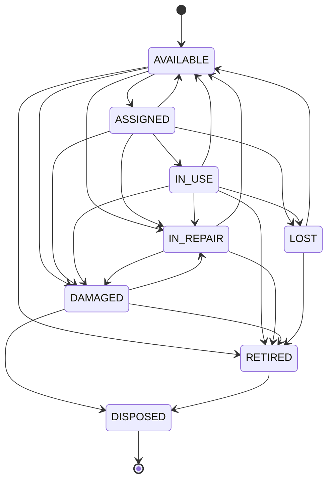
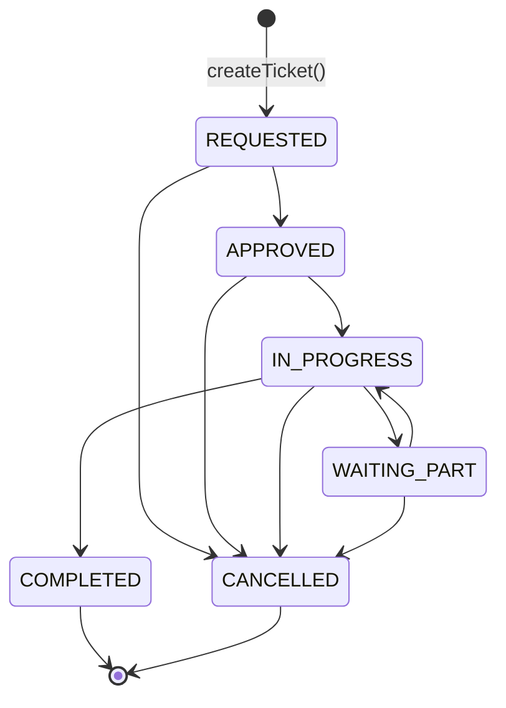
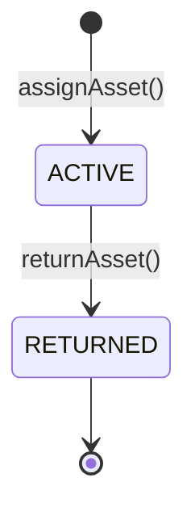

# 05-state-machines.md — State Machine / Lifecycle Specification
# BPTI Inventory & Asset Management System

**Snapshot diaudit:** v4 (`bpti-project-main__1_.zip`, 2026-09-24) — lihat `README.md` §1
**Legenda status:** lihat `README.md` §2. Lihat `04-business-rules.md` BR-016/BR-018 untuk analisis kesenjangan penegakan di balik diagram ini.

---

## 1. Asset — `AssetStatus` (8 nilai)

Sumber: `LEGAL_TRANSITIONS` (`asset-service.ts:7-16`), satu-satunya definisi formal transisi legal di seluruh basis kode.

### Tabel transisi legal (persis dari `LEGAL_TRANSITIONS`)

| Dari \ Ke | AVAILABLE | ASSIGNED | IN_USE | IN_REPAIR | DAMAGED | LOST | RETIRED | DISPOSED |
|---|:-:|:-:|:-:|:-:|:-:|:-:|:-:|:-:|
| **AVAILABLE** | — | ✓ | | ✓ | ✓ | | ✓ | |
| **ASSIGNED** | ✓ | — | ✓ | ✓ | ✓ | ✓ | | |
| **IN_USE** | ✓ | | — | ✓ | ✓ | ✓ | ✓ | |
| **IN_REPAIR** | ✓ | | | — | ✓ | | ✓ | |
| **DAMAGED** | | | | ✓ | — | | ✓ | ✓ |
| **LOST** | ✓ | | | | | — | ✓ | |
| **RETIRED** | | | | | | | — | ✓ |
| **DISPOSED** | | | | | | | | — *(status akhir, tidak ada transisi keluar)* |

Catatan: `IN_USE` tidak pernah dijadikan status asal transisi manapun oleh kode mutasi manapun (lihat §4) — statusnya ada di enum dan di tabel transisi (sebagai tujuan dari `ASSIGNED`), tapi tidak ada jalur kode yang benar-benar menyetel status ke `IN_USE`. Kemungkinan disiapkan untuk pembedaan "sudah di-assign tapi belum dipakai" vs "sedang dipakai aktif" yang belum diimplementasikan operatornya.

## 2. Siapa yang benar-benar mengubah `AssetStatus` di produksi (vs. tabel di atas)

Ini bagian terpenting dokumen ini — **tabel §1 adalah aturan yang *didefinisikan*, bukan otomatis aturan yang *ditegakkan*.** Detail evidensi lengkap ada di `04-business-rules.md` BR-016; ringkasannya:

| Fungsi | Transisi yang ditulis | Memeriksa `LEGAL_TRANSITIONS`? |
|---|---|:-:|
| `AssetService.updateStatus()` (`asset-service.ts:175-209`) | *(bebas, sesuai tabel §1)* | ✅ Ya — **tapi tidak pernah dipanggil dari action manapun** |
| `AssetService.assignAsset()` | → `ASSIGNED` (hanya dari `AVAILABLE`) | ⚠️ Tidak lewat tabel, tapi kebetulan sesuai |
| `AssetService.returnAsset()` | → `AVAILABLE` atau `DAMAGED` | ⚠️ Tidak lewat tabel; tidak memeriksa status asal |
| `MaintenanceService.createTicket()` | → `IN_REPAIR`, **tanpa syarat** | ❌ Tidak — bisa melanggar tabel (lihat BR-016) |
| `MaintenanceService.updateStatus()` | `IN_REPAIR` → `AVAILABLE` (saat selesai/batal) | ⚠️ Tidak lewat tabel; tidak memeriksa status Asset terkini |

## 3. Maintenance — `MaintenanceStatus` (6 nilai)

Berbeda dari Asset, **tidak ada tabel transisi legal untuk `MaintenanceStatus` di kode manapun** (`04-business-rules.md` BR-018). Diagram di bawah menggambarkan alur yang **diniatkan** oleh urutan nilai enum di `schema.prisma:379-386`, bukan aturan yang ditegakkan:

**Realitas kode:** `MaintenanceService.updateStatus()` (`maintenance-service.ts:72-119`) menerima parameter `status` bertipe `MaintenanceStatus` dan langsung menuliskannya (baris 88) tanpa memeriksa nilai `record.status` saat ini — **panah manapun di diagram di atas bisa "dilompati"** (mis. `REQUESTED` langsung ke `COMPLETED`) selama pemanggilnya lolos `requirePermission(MAINTENANCE_UPDATE)`. Efek samping baris 97-105 (kembalikan Asset ke `AVAILABLE`) hanya dipicu oleh nilai tujuan `COMPLETED`/`CANCELLED`, terlepas dari status asalnya — jadi efek sampingnya sendiri tetap benar walau urutannya dilompati.

**Sisi UI:** `MaintenanceModal` (dipasang di v3) hanya memanggil `createMaintenanceTicketAction` — tidak ada UI yang memanggil `updateMaintenanceStatusAction` sampai snapshot v4 (`README.md` §5 #1). Jadi secara *end-to-end* dari browser, diagram di atas belum bisa diuji sama sekali hari ini — hanya transisi `[*] → REQUESTED` yang bisa dipicu pengguna nyata.

## 4. Assignment — `AssignmentStatus` (2 nilai, paling sederhana)

- `ACTIVE → RETURNED` adalah satu-satunya transisi yang mungkin (`AssetService.returnAsset()`, `asset-service.ts:264-317`) — baris 275-277 melempar error kalau assignment sudah `RETURNED`, jadi transisi ini **idempotency-safe** (tidak bisa dipanggil dua kali pada assignment yang sama).
- Tidak ada jalur `RETURNED → ACTIVE` (assignment tidak bisa "dibuka lagi") — desain yang konsisten dengan `AssetAssignment` sebagai catatan riwayat, bukan objek yang diedit berulang.
- **Berbeda dari konsep "peminjaman" di scope resmi PKL** (`00-RECONCILIATION.md` §2): model ini tidak punya `dueDate`/tenggat, sehingga tidak ada status turunan seperti `TERLAMBAT` — assignment tetap `ACTIVE` selamanya sampai di-*return* secara eksplisit, berapa pun lama waktunya. `AlertType.OVERDUE_RETURN` ada di skema (`schema.prisma:443`) tapi tidak pernah dipakai kode manapun — kemungkinan disiapkan untuk kapan pun konsep tenggat waktu ditambahkan.

## 5. Stock — bukan state machine, tapi ledger

`Stock.quantity` **bukan** field yang berpindah antar status diskrit — ia adalah saldo turunan (*derived*) dari akumulasi baris `StockMovement` (ledger append-only). Lihat `03-domain-model.md` Invariant I-2 dan `04-business-rules.md` BR-011/BR-012 untuk aturan validasinya. Tidak ada diagram status untuk bagian ini karena secara konseptual berbeda — ledger transaksional, bukan lifecycle objek.

## 6. Cakupan pengujian otomatis terhadap state machine ini

`src/__tests__/asset-lifecycle.test.ts` menguji `isValidAssetTransition()`/`LEGAL_TRANSITIONS` langsung sebagai fungsi murni (ditambahkan sejak v3, saat fungsi ini diekstrak dari `switch` inline). `src/__tests__/inventory-logic.test.ts` menguji `calculateNewStock()` langsung. **Tidak ada test yang menguji `MaintenanceStatus`** (tidak ada tabel legalitas untuk diuji — konsisten dengan BR-018) atau yang menguji jalur *integrasi* (mis. memanggil `createTicket()` sungguhan lalu memeriksa efek sampingnya pada `Asset.status`) — ketiga file test yang ada murni menguji fungsi logika, bukan service/Prisma/transaction end-to-end. Detail lengkap di `32-traceability-matrix.md`.
