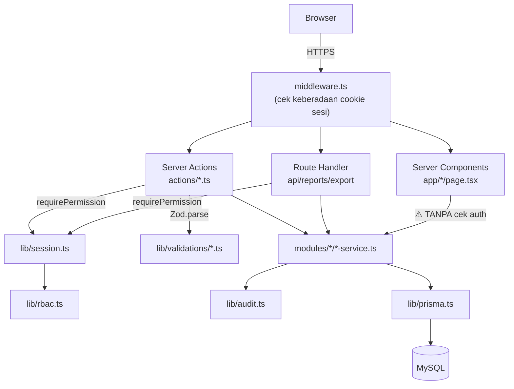

# 13-module-boundaries.md — Architecture Blueprint & Module Boundaries (as-built)
# BPTI Inventory & Asset Management System

**Snapshot diaudit:** v4 (`bpti-project-main__1_.zip`, 2026-09-24) — lihat `README.md` §1
**Melengkapi Blueprint #12 (Architecture) dan #14 (Dependency Rules).**
**Legenda status:** lihat `README.md` §2

---

## 1. Gaya arsitektur

**Modular monolith** — satu aplikasi Next.js (App Router), satu database MySQL, modul domain dipisah sebagai folder `src/modules/<domain>/` dengan satu file `*-service.ts` berisi `static` methods per modul. Ini sesuai niat `AGENTS.md` §7 dan `SRS.md` §24 (TAR-001).

Panah "⚠️ TANPA cek auth" dari Server Component ke service layer adalah representasi visual dari `README.md` Temuan #2 — lihat `23-threat-model.md` untuk analisis lengkap.

## 2. Pola yang konsisten di setiap lapisan

| Lapisan | Folder | Pola |
|---|---|---|
| Route protection | `src/middleware.ts` | Cek keberadaan cookie `better-auth.session_token` — gerbang kasar, bukan verifikasi tanda tangan. |
| Presentasi (baca) | `src/app/*/page.tsx` | Server Component `async`, memanggil `*Service.getX()` langsung, `Promise.all` untuk data referensi (locations/departments/dll.) sejak v4. |
| Presentasi (interaktif) | `src/components/modals/*.tsx` | Client Component (`"use client"`), `useState` untuk form state (bukan React Hook Form meski disebut di baseline — `README.md` Temuan #6), memanggil satu Server Action, validasi HTML `required` di sisi klien sebagai lapisan pertama saja. |
| Orkestrasi mutasi | `src/actions/*.ts` | `"use server"` implisit per-file; urutan tetap: `requirePermission(PERMISSIONS.X)` → `schema.parse(input)` → `Service.method()` → `revalidatePath()`. Mengembalikan `{success, error}` seragam — bukan melempar exception ke client. |
| Validasi | `src/lib/validations/*.ts` | Satu file per domain (`asset`, `inventory`, `location`, `maintenance`, `user`), satu skema Zod per operasi. |
| Domain logic | `src/modules/<domain>/<domain>-service.ts` | `class XService { static async method() }` — bukan instance/DI. Setiap mutasi majemuk dibungkus `prisma.$transaction`. Memanggil `recordAudit()` di akhir setiap mutasi yang berhasil. |
| Cross-cutting | `src/lib/{audit,logger,prisma,rbac,session,auth,auth-client}.ts` | File tunggal per concern, bukan folder — lebih ringkas dari yang diusulkan `SRS.md` §25 (lihat §4). |

## 3. Kepemilikan modul (module ownership)

| Modul | Memiliki model | File `*-service.ts` | Dikonsumsi oleh action/route |
|---|---|---|---|
| Identity & Access | `User`, `Role`, `Permission`, `RolePermission`, `Department`, `Session`, `Account`, `Verification` | `modules/users/user-service.ts` | `user-actions.ts` |
| Locations | `Location` | `modules/locations/location-service.ts` | `location-actions.ts` |
| Inventory | `Category`, `InventoryItem`, `Stock`, `StockMovement` | `modules/inventory/inventory-service.ts` | `inventory-actions.ts` |
| Assets | `Asset`, `AssetAssignment`, `AssetTransfer` | `modules/assets/asset-service.ts` | `asset-actions.ts` |
| Maintenance | `MaintenanceRecord` | `modules/maintenance/maintenance-service.ts` | `maintenance-actions.ts` |
| Monitoring | *(agregasi lintas-modul, read-only)* | `modules/monitoring/monitoring-service.ts` | `dashboard/page.tsx` langsung (tanpa action, karena murni baca) |
| Reports | *(agregasi lintas-modul, read-only)* | `modules/reports/report-service.ts` | `reports/page.tsx`; `api/reports/export/route.ts` (jalur ekspor CSV **tidak** lewat `report-service.ts` — lihat §5) |
| Audit | `AuditLog`, `SystemAlert` | `lib/audit.ts` (bukan `modules/audit/`) | `audit/page.tsx` — lihat pelanggaran batas di §5 |

## 4. Penyimpangan dari struktur yang diusulkan `SRS.md` §25

`SRS.md` §25 mengusulkan struktur route-group (`app/(auth)/`, `app/(dashboard)/`) dan layering penuh per modul (`domain/`, `application/`, `infrastructure/`, `schemas/` sebagai sub-folder terpisah tiap modul) serta `lib/` sebagai folder-folder terpisah per concern (`lib/auth/`, `lib/db/`, `lib/validation/`, dst.). **Implementasi nyata jauh lebih flat**: tidak ada route group, satu file `*-service.ts` per modul (bukan 4 sub-layer), `lib/*.ts` sebagai file tunggal, dan `src/actions/`/`src/lib/validations/` sebagai folder tambahan yang **tidak ada** di proposal SRS sama sekali.

**Ini bukan penyimpangan yang buruk.** Untuk tim 4 orang dengan waktu 7 minggu, struktur flat yang diimplementasikan **lebih cepat ditulis, lebih mudah dinavigasi, dan tetap menjaga batas modul dengan disiplin** (§6) — trade-off yang wajar mengingat proposal `SRS.md` §25 ditulis sebelum implementasi dimulai (fase Domain/Architecture, sebelum ada bukti empiris tentang skala tim yang sebenarnya). **Rekomendasi:** tuliskan ini sebagai ADR pendek (`docs/adr/ADR-001-flat-module-structure.md`, Blueprint #15 yang masih kosong) — bukan untuk mengubah kode, tapi supaya `SRS.md` §25 tidak lagi jadi sumber kebingungan bagi pembaca berikutnya yang menyangka struktur folder salah dibangun.

## 5. Pelanggaran batas modul yang ditemukan (kecil, terisolasi)

1. **`app/audit/page.tsx`** memanggil `prisma.auditLog.findMany()` **langsung**, bukan lewat `AuditService` (yang memang tidak ada — audit hanya punya `lib/audit.ts` untuk menulis, bukan modul lengkap untuk membaca). Konsekuensi: kalau suatu saat aturan baca audit log berubah (mis. filter per departemen), perubahan itu harus diingat untuk ditambahkan langsung di halaman, bukan di satu tempat terpusat.
2. **`api/reports/export/route.ts`** mengimpor `prisma` langsung (baris 2) dan melakukan query ke **lima model berbeda tanpa lewat service layer manapun**: `prisma.inventoryItem.findMany` (baris 36), `prisma.asset.findMany` (baris 85), `prisma.stockMovement.findMany` (baris 130), `prisma.maintenanceRecord.findMany` (baris 172), `prisma.auditLog.findMany` (baris 214) — satu Route Handler ini secara efektif menembus batas Inventory, Assets, Maintenance, dan Audit sekaligus. Route ini sendiri tetap dilindungi dengan benar (`requirePermission(REPORT_EXPORT)`, baris 3), jadi ini murni soal konsistensi arsitektur, bukan celah keamanan — tapi ini contoh paling luas dari pola "akses data langsung tanpa service layer" di seluruh basis kode.
3. Kedua kasus ini **terisolasi pada operasi baca**, tidak melibatkan mutasi data — jadi bukan risiko integritas data, murni soal konsistensi arsitektur.

## 6. Aturan dependency yang benar-benar ditegakkan (diverifikasi lewat `grep`, bukan hanya niat)

- ✅ **Nol import lintas-modul** antar `src/modules/*/​*-service.ts` — setiap service hanya bergantung pada `@/lib/prisma`, `@/lib/audit`, `@prisma/client`, dan (untuk `user-service.ts`) `better-auth/crypto`.
- ✅ **Nol import lintas-action** antar `src/actions/*.ts` — setiap action file berdiri sendiri, tidak saling memanggil.
- ✅ **Komponen modal tidak pernah mengimpor Prisma client sungguhan** (`@/lib/prisma`) — hanya mengimpor tipe/enum dari `@prisma/client` (mis. `AssetCondition`, `MovementType`) untuk opsi `<select>`, yang aman karena hanya definisi tipe/konstanta, bukan koneksi database.
- ⚠️ Yang **tidak** ditegakkan: tidak ada aturan eksplisit (lint rule/arsitektur test) yang mencegah Server Component `app/*/page.tsx` memanggil service module manapun secara langsung tanpa lewat lapisan otorisasi — inilah akar teknis dari `README.md` Temuan #2 (lihat `23-threat-model.md` untuk pembahasan risikonya).
