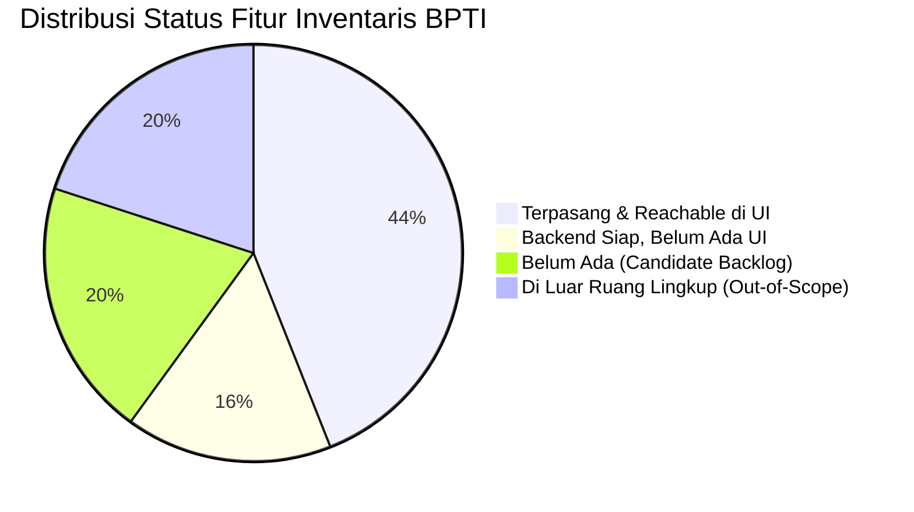

# LAPORAN AUDIT GAP V7: SISTEM INVENTARIS & ASET BPTI UHAMKA
**Dokumen Acuan:** `Project_Charter_Sistem_Inventaris_BPTI_UHAMKA.md`, `SRS_Inventaris_BPTI_UHAMKA_Lengkap.md`, `00-RECONCILIATION.md`, `03-domain-model.md`, `04-business-rules.md`, `05-state-machines.md`, `13-module-boundaries.md`, `17-data-dictionary.md`, `22-authorization-matrix.md`, `23-threat-model.md`, `32-traceability-matrix.md`, `AGENTS.md`, `stop-slop.md`  
**Waktu Audit:** 1 Oktober 2026  
**Lensa Audit:** Rekayasa Perangkat Lunak, Penegakan Aturan Bisnis, Keamanan RBAC, Deteksi AI Slop, Kesiapan Demo PKL  
**Standar Evidensi:** `[VERIFIED-IN-CODE]` berbasis baris kode aktual (`file:line`), verifikasi statis (`tsc`, `eslint`), verifikasi dinamis (`vitest`), dan kompilasi produksi (`next build`).

---

## 1. Ringkasan Eksekutif & Status Toolchain

Sistem Informasi Inventaris BPTI UHAMKA saat ini telah bertransformasi dari prototipe 3 tabel awal PKL menjadi arsitektur modular monolith tingkat produksi (19 model Prisma, 9 enum, proteksi RBAC Better Auth, serta pengujian terotomatisasi).

Hasil uji kepatuhan toolchain lokal per 1 Oktober 2026:

| Parameter Pengujian | Perintah Eksekusi | Hasil Empiris | Status |
|---|---|---|:---:|
| **Pemeriksaan Tipe TypeScript** | `pnpm run typecheck` (`tsc --noEmit`) | 0 galat (Exit Code 0) | ✅ LULUS |
| **Pemeriksaan Gaya Kode (Linter)** | `pnpm run lint` (`eslint src/`) | 0 peringatan, 0 galat (Exit Code 0) | ✅ LULUS |
| **Rangkaian Uji Unit & Integrasi** | `pnpm test` (`vitest run`) | 54/54 pengujian lulus dalam 8 test suites | ✅ LULUS |
| **Kompilasi Rute Produksi** | `npx next build` (Turbopack) | 16/16 rute berhasil dikompilasi (Exit Code 0) | ✅ LULUS |

Rincian 16 rute produksi yang terverifikasi aktif:
1. `○ /` (Redirect ke dashboard/login)
2. `○ /login` (Autentikasi kredensial pengguna)
3. `ƒ /dashboard` (Ringkasan metrik, grafik tren stok, dan status aset)
4. `ƒ /inventory` (Katalog master barang, filter kategori, stock in/out, impor massal)
5. `ƒ /assets` (Katalog aset fisik, filter lokasi/departemen, cetak tag, impor massal)
6. `ƒ /assets/[id]` (Halaman detail spesifikasi, QR code, riwayat pinjam/mutasi/servis)
7. `ƒ /assignments` (Pencatatan sirkulasi serah terima, batas waktu, pengembalian fisik)
8. `ƒ /locations` (Pohon hierarki gedung, lantai, dan ruangan kerja)
9. `ƒ /maintenance` (Antrean tiket servis, persetujuan manajer, riwayat penyelesaian)
10. `ƒ /reports` (Ringkasan agregat dan unduh laporan berkas PDF/Excel)
11. `ƒ /audit` (Jejak audit aktivitas pengguna dan riwayat transaksi sistem)
12. `ƒ /users` (Manajemen pengguna, penugasan peran, dan toggle status aktif)
13. `ƒ /api/auth/[...all]` (Route handler endpoint Better Auth)
14. `ƒ /api/reports/export` (Ekspor dinamis berkas XLSX, PDF, dan CSV)
15. `ƒ /api/templates/import` (Unduh berkas template master data Excel/CSV)
16. `○ /_not-found` (Halaman penanganan galat 404)

---

## 2. Matriks Temuan Kesenjangan Kode & Konfigurasi (Gaps)

Penyelidikan mendalam terhadap basis data, service layer, Server Actions, route handlers, dan antarmuka menghasilkan 8 temuan kesenjangan konkret berikut:

### GAP-01: Transfer Stok Barang Inventaris Belum Lengkap (Setengah Jalan)
* **Tingkat Kritis:** Tinggi (Integritas Buku Besar Stok)
* **Evidensi Kode:**
  - `src/modules/inventory/inventory-service.ts:50-57`: Fungsi `calculateNewStock` menghitung pengurangan stok untuk `MovementType.TRANSFER` (`currentQty - quantity`).
  - `src/modules/inventory/inventory-service.ts:15-23`: Antarmuka `StockTransactionDTO` hanya menerima satu `locationId`. Tidak ada field `toLocationId`.
  - `src/modules/inventory/inventory-service.ts:168-248`: Metode `transactStock` hanya memutakhirkan satu baris stok pada lokasi asal. Stok tidak pernah ditambahkan ke lokasi tujuan.
  - `src/lib/validations/inventory.ts:18-27`: Skema Zod `transactStockSchema` tidak menerima `toLocationId`.
  - `src/components/modals/inventory-modal.tsx:98-132`: Tombol pemicu pada antarmuka hanya menyediakan pilihan `Stock In` dan `Stock Out`. Tidak ada antarmuka untuk mutasi transfer barang habis pakai antargudang.
* **Dampak:** Jika mutasi bertipe `TRANSFER` dipanggil, kuantitas barang berkurang dari lokasi asal namun lenyap tanpa pernah tercatat pada lokasi tujuan.
* **Rekomendasi Tindak Lanjut:** 
  1. Tambahkan `toLocationId` pada `transactStockSchema`.
  2. Perluas `InventoryService.transactStock` agar dalam transaksi atomik (`tx.$transaction`) menambahkan stok pada `toLocationId` serta mencatat dua rekaman mutasi (pengurangan di asal dan penambahan di tujuan).
  3. Sediakan tombol pemicu `Stock Transfer` pada `inventory-modal.tsx`.

### GAP-02: Modul Lokasi Belum Memiliki Fitur Pembaruan & Penghapusan/Deaktivasi
* **Tingkat Kritis:** Sedang (Kelengkapan Master Data)
* **Evidensi Kode:**
  - `src/modules/locations/location-service.ts:1-124`: Hanya mengimplementasikan `getLocations`, `getLocationById`, dan `createLocation`. Tidak ada metode `updateLocation` atau `deleteLocation`/`deactivateLocation`.
  - `src/actions/location-actions.ts:11-35`: Hanya mengekspos `createLocationAction`.
  - `src/modules/locations/location-service.ts:93-112`: Saat mendaftarkan lokasi anak (`parentId`), tidak ada verifikasi siklus hierarki (misalnya node A menjadi induk node B, lalu node B diset sebagai induk node A).
* **Dampak:** Administrator yang salah mengetik nama gedung, ruangan, atau salah menentukan hierarki lantai tidak dapat memperbaikinya lewat antarmuka web dan harus mengedit langsung basis data MySQL.
* **Rekomendasi Tindak Lanjut:**
  1. Buat `updateLocationAction` dan metode `updateLocation` di `location-service.ts`.
  2. Tambahkan validasi pendeteksi siklus relasi induk-anak.
  3. Tambahkan tombol edit lokasi pada tabel antarmuka `src/app/locations/page.tsx`.

### GAP-03: Ketiadaan Antarmuka Manajemen Kategori Barang (Kategori Yatim UI)
* **Tingkat Kritis:** Sedang (Usabilitas Pengguna)
* **Evidensi Kode:**
  - `prisma/schema.prisma:191-202`: Model `Category` memiliki relasi satu-ke-banyak dengan `InventoryItem`.
  - `src/actions/bulk-import-actions.ts:143-162`: Kategori otomatis dibuat saat proses impor massal Excel jika nama kategori belum terdaftar.
  - Namun di seluruh direktori `src/app/` dan `src/components/`, tidak ada rute halaman `/categories` maupun modal dialog untuk menambah, mengubah, atau menghapus kategori barang secara mandiri.
* **Dampak:** Pengguna harus mengandalkan file seed awal atau menyisipkan kategori baru lewat file impor Excel; tidak ada kendali katalog kategori manual di aplikasi.
* **Rekomendasi Tindak Lanjut:** Sediakan modal CRUD kategori pada halaman `src/app/inventory/page.tsx` di samping tombol `Add Item`.

### GAP-04: Ketidakselarasan Model Peminjaman Tunggal (Single-Admin vs User Mandatori)
* **Tingkat Kritis:** Tinggi (Kesesuaian SOP Sirkulasi PKL)
* **Evidensi Kode:**
  - `prisma/schema.prisma:356-359`: Tabel `asset_assignments` memiliki kolom manual `borrowerName`, `borrowerContact`, dan `purpose` khusus untuk skenario peminjam luar yang tidak memiliki akun login.
  - `src/app/assignments/page.tsx:217-220`: Tabel antarmuka menampilkan `{item.holder?.name || item.borrowerName || "Peminjam Luar"}`.
  - Namun pada `src/lib/validations/asset.ts:24-30`: `assignAssetSchema` menetapkan `holderId: z.string().min(1)` sebagai kewajiban mutlak.
  - `src/modules/assets/asset-service.ts:241-270`: Fungsi `assignAsset` tidak menerima parameter `borrowerName`, `borrowerContact`, ataupun `purpose`.
  - `src/components/modals/assignment-modal.tsx:25-30`: Form antarmuka hanya menampilkan dropdown pilihan pengguna terdaftar (`users`).
* **Dampak:** Skenario riil kantor BPTI di mana dosen atau staf luar meminjam proyektor/kabel tanpa memiliki akun sistem tidak dapat diinput oleh Admin melalui form peminjaman aset.
* **Rekomendasi Tindak Lanjut:**
  1. Perbarui `assignAssetSchema` agar `holderId` bersifat opsional (`z.string().optional()`), dan terima input alternatif `borrowerName`, `borrowerContact`, serta `purpose`.
  2. Mutakhirkan `AssetService.assignAsset` untuk menyimpan data peminjam manual ke kolom yang sudah tersedia di skema Prisma.
  3. Tambahkan tab/pilihan "Pegawai Internal" vs "Peminjam Luar/Tamu" pada form `assignment-modal.tsx`.

### GAP-05: Peringatan Operasional Bersifat Satu Arah dan Belum Otomatis
* **Tingkat Kritis:** Sedang (Efektivitas Monitoring)
* **Evidensi Kode:**
  - `prisma/schema.prisma:477-485`: Enum `AlertType` mendefinisikan `LOW_STOCK`, `OUT_OF_STOCK`, `OVERDUE_RETURN`, `MAINTENANCE_DUE`, `MAINTENANCE_OVERDUE`, dan `UNVERIFIED_ASSET`.
  - `src/modules/inventory/inventory-service.ts:225-235`: Hanya `LOW_STOCK` dan `OUT_OF_STOCK` yang pernah dibuat saat transaksi stok menembus batas minimum.
  - Di seluruh basis kode, tipe `OVERDUE_RETURN`, `MAINTENANCE_DUE`, `MAINTENANCE_OVERDUE`, dan `UNVERIFIED_ASSET` tidak pernah dibuat sama sekali (`grep` menunjukkan 0 pemanggilan).
  - `src/modules/monitoring/monitoring-service.ts:32-36`: Mengambil 5 alert aktif yang belum diselesaikan (`isResolved: false`).
  - Tidak ada Server Action atau tombol pada UI untuk menandai peringatan telah diselesaikan (`isResolved: true`, `resolvedAt: new Date()`).
* **Dampak:** Peringatan stok menumpuk selamanya pada dasbor tanpa bisa dibersihkan atau diakui oleh Admin, sementara peringatan keterlambatan peminjaman tidak pernah muncul otomatis.
* **Rekomendasi Tindak Lanjut:**
  1. Buat Server Action `resolveAlertAction(alertId: string)`.
  2. Implementasikan fungsi terjadwal/cron ringan pada saat pemuatan dasbor untuk memeriksa aset dengan `dueDate < now()` yang masih berstatus `ACTIVE` dan membuat `SystemAlert` bertipe `OVERDUE_RETURN`.

### GAP-06: Ketiadaan Ekspor Laporan Sirkulasi & Anomali Judul Stock Opname
* **Tingkat Kritis:** Rendah-Sedang (Kepatuhan Pelaporan)
* **Evidensi Kode:**
  - `src/app/api/reports/export/route.ts:27-233`: Menyediakan kasus ekspor untuk `inventory`, `assets`, `movements`, `maintenance`, dan `audit`. Tidak ada kasus untuk `assignments` (peminjaman) ataupun `transfers`.
  - `src/app/reports/page.tsx:64-70`: Kartu laporan berjudul "Stock Opname Reconciliation Sheet" dengan deskripsi formulir rekonsiliasi fisik mengirim parameter `type="movements"`.
  - Akibatnya, saat pengguna mengklik kartu tersebut, sistem hanya mengunduh log transaksi pergerakan stok historis biasa, bukan formulir selisih stok opname fisik.
* **Dampak:** Laporan rekapitulasi sirkulasi peminjaman tidak dapat diekspor ke Excel/PDF, dan judul kartu laporan membingungkan pengguna.
* **Rekomendasi Tindak Lanjut:**
  1. Tambahkan handler ekspor `assignments` pada `route.ts`.
  2. Selaraskan judul kartu pada `reports/page.tsx` menjadi "Buku Besar Mutasi Stok" atau buat generator lembar stok opname tersendiri.

### GAP-07: Kolom Basis Data Tidur (Dead & Dormant Schema Fields)
* **Tingkat Kritis:** Rendah (Efisiensi & Kebersihan Data)
* **Evidensi Kode:**
  - `prisma/schema.prisma:234`: Kolom `Stock.reservedQty` bernilai default 0 dan tidak pernah dibaca maupun ditulis dalam alur reservasi barang.
  - `prisma/schema.prisma:165`: Kolom `Location.type` disimpan dan ditampilkan sebagai lencana visual, namun tidak memiliki aturan bisnis yang membatasi jenis barang yang boleh disimpan di dalamnya.
  - `prisma/schema.prisma:122-133`: Tabel `RolePermission` tidak pernah diisi data; hak akses seluruh pengguna mengacu 100% pada pemetaan hardcoded `ROLE_DEFAULT_PERMISSIONS` di `src/lib/rbac.ts`.
  - `prisma/schema.prisma:86-96`: Tabel `Verification` Better Auth tidak pernah dipakai karena verifikasi email dan lupa sandi belum diaktifkan.
* **Rekomendasi Tindak Lanjut:** Dokumentasikan kolom ini sebagai cadangan ekspansi masa depan atau rapikan skema pada migrasi besar berikutnya.

### GAP-08: Pengguna Tidak Dapat Diubah Data Dasarnya (User Editability Gap)
* **Tingkat Kritis:** Sedang (Operasional Administrasi)
* **Evidensi Kode:**
  - `src/modules/users/user-service.ts:75-164`: Menyediakan `createUser` dan `toggleUserStatus`. Tidak ada metode `updateUser`.
  - `src/actions/user-actions.ts:8-48`: Hanya menyediakan `createUserAction` dan `toggleUserStatusAction`.
  - `src/app/users/page.tsx:170-195`: Tidak ada tombol edit pengguna pada tabel.
* **Dampak:** Jika staf berganti nama, salah menginput alamat email, atau berpindah departemen/peran, Administrator harus mengedit tabel basis data secara langsung atau menonaktifkan akun lalu membuat akun baru.
* **Rekomendasi Tindak Lanjut:** Implementasikan `updateUserAction` dan modal edit profil/peran pengguna pada antarmuka admin.

---

## 3. Analisis & Klasifikasi Fitur Website Inventaris

Berdasarkan analisis silang antara `Project_Charter_Sistem_Inventaris_BPTI_UHAMKA.md` (§3), `SRS_Inventaris_BPTI_UHAMKA_Lengkap.md` (BAB 2 & BAB 4), dan basis kode nyata:

### Kategori 1: Fitur yang Sudah Terimplementasi & Reachable di Antarmuka
1. **Dasbor Analitik Operasional**: Visualisasi metrik total aset, stok menipis, tiket servis aktif, diagram lingkaran sebaran status aset, dan grafik tren mutasi bulanan (`src/app/dashboard/page.tsx`).
2. **Katalog Master Barang (Habis Pakai)**: Tambah barang baru, batas stok minimum/maksimum, filter kategori, pencarian reaktif, dan paginasi server (`src/app/inventory/page.tsx`).
3. **Pencatatan Mutasi Stok Masuk & Keluar**: Perekaman transaksi penambahan stok pengadaan dan pengeluaran barang dengan pembaruan saldo real-time (`src/components/modals/inventory-modal.tsx`).
4. **Pendaftaran Aset Individual Terlacak**: Registrasi unit bernomor seri, tag unik institusi, kondisi fisik, nilai perolehan, tanggal garansi, dan penjanaan otomatis QR Code (`src/app/assets/page.tsx`).
5. **Halaman Rincian Riwayat Hidup Aset**: Tampilan komprehensif data teknis aset, kode QR siap pindai, riwayat peminjam, riwayat mutasi ruangan, dan log perbaikan teknis (`src/app/assets/[id]/page.tsx`).
6. **Sirkulasi Penugasan / Peminjaman Aset**: Penyerahan unit berstatus `AVAILABLE`, penetapan tanggal jatuh tempo, dan kalkulasi otomatis masa peminjaman aktif (`src/app/assignments/page.tsx`).
7. **Pengembalian Aset & Evaluasi Fisik**: Konfirmasi barang kembali dengan pencatatan kondisi fisik (`EXCELLENT`, `GOOD`, `FAIR`, `POOR`, `BROKEN`) dan otomatisasi transisi status aset ke `AVAILABLE` atau `DAMAGED` (`src/components/modals/return-asset-modal.tsx`).
8. **Mutasi Antar-Ruangan & Pemindahan Penanggung Jawab**: Pemindahan lokasi penempatan fisik aset antar gedung/lantai/ruangan disertai alasan mutasi (`src/components/modals/assignment-modal.tsx`).
9. **Manajemen Tiket Pemeliharaan Perangkat**: Pembuatan tiket perbaikan dengan penegakan status guard (`canCreateMaintenanceTicket`) dan pembaruan alur kerja servis linier oleh teknisi (`src/app/maintenance/page.tsx`).
10. **Ekspor Laporan Resmi Multiformat**: Ekspor berkas katalog barang, data aset, pergerakan stok, servis, dan jejak audit ke dalam format XLSX, PDF, dan CSV (`src/app/reports/page.tsx`).
11. **Impor Massal Master Data**: Pengunggahan berkas Excel/CSV untuk pendaftaran ratusan item inventaris dan aset sekaligus dengan validasi Zod berlapis (`src/components/modals/bulk-import-modal.tsx`).

### Kategori 2: Fitur yang Siap di Backend tetapi Belum Memiliki Antarmuka (Not UI-Reachable)
1. **Manajemen Kategori Barang Mandiri**: Skema basis data dan relasi sudah ada, tetapi belum ada tombol atau halaman untuk membuat kategori baru secara manual di UI.
2. **Manajemen Departemen / Unit Kerja Mandiri**: Model `Department` terdaftar dan berelasi ke user, aset, serta lokasi, namun datanya hanya bisa dimasukkan lewat seed basis data.
3. **Pembaruan Data Profil / Peran Pengguna**: Pengguna hanya dapat diundang dan dimatikan statusnya; belum ada modal untuk mengubah nama, email, departemen, atau peran akun yang sudah ada.
4. **Mutasi Pengembalian Stok Habis Pakai (`RETURN`) & Penyesuaian Nilai (`ADJUSTMENT`)**: Logika `calculateNewStock` mendukung `RETURN` dan `ADJUSTMENT`, namun modal transaksi stok di antarmuka hanya memunculkan tombol `Stock In` dan `Stock Out`.

### Kategori 3: Fitur Inventaris yang BELUM Diimplementasikan (Backlog Tim PKL)
Fitur-fitur ini sangat bernilai dan realistis diselesaikan tim PKL sebelum penutupan proyek:
1. **Modul Rekonsiliasi Stok Fisik (Stock Opname)**: 
   - Antarmuka pencatatan hasil hitung fisik gudang berkala versus saldo sistem.
   - Pemanfaatan mutasi `MovementType.ADJUSTMENT` untuk otomatis menyesuaikan saldo jika terjadi selisih fisik.
2. **Cetak Berita Acara Serah Terima (BAST) Peminjaman / Pengembalian**:
   - Generator dokumen cetak PDF satu halaman berisi bukti serah terima peminjaman proyektor/laptop dengan kolom tanda tangan peminjam dan petugas admin BPTI.
3. **Otomatisasi Peringatan Keterlambatan Sirkulasi (`OVERDUE_RETURN`)**:
   - Pembuatan otomatis entri `SystemAlert` saat aset peminjaman melewati tanggal `dueDate` dan belum dikembalikan.
4. **Antarmuka Manajemen Kategori & Departemen Terintegrasi**:
   - Modal sederhana untuk menambah dan mengubah nama kategori barang serta kode departemen kampus.
5. **Pencarian Riwayat Sirkulasi Berdasarkan Nama Peminjam**:
   - Fitur filter untuk melihat seluruh barang yang pernah dipinjam oleh dosen atau staf tertentu.

### Kategori 4: Fitur yang TIDAK PERLU Diimplementasikan (Out-of-Scope / YAGNI)
Sesuai Project Charter §3 dan SRS BAB 2, tim dilarang mengimplementasikan fitur-fitur berikut demi menghindari pembengkakan ruang lingkup (*scope creep*) dan kerumitan arsitektur:
1. **Portal Mandiri / Katalog Publik untuk Pegawai Umum (Self-Service Viewer)**:
   - Sifat operasional BPTI UHAMKA adalah layanan satu pintu di kantor fisik. Pegawai mendatangi kantor secara langsung dan Admin yang mengoperasikan sistem. Peran `VIEWER` ditiadakan.
2. **Alur Kerja Persetujuan Daring Bertingkat (Online Multi-Level Approval)**:
   - Birokrasi persetujuan peminjaman barang kantor dilakukan secara verbal atau formulir nota dinas fisik di kantor, bukan alur tanda tangan digital berbelit-belit di aplikasi.
3. **Integrasi Single Sign-On (SSO) Kampus Eksternal (Google / Microsoft Azure AD)**:
   - Sistem dirancang untuk operasional intranet/jaringan lokal kantor BPTI UHAMKA. Menghubungkan SSO publik memerlukan domain publik, sertifikat SSL publik, dan konfigurasi OAuth kampus yang berada di luar mandat tim PKL.
4. **Pemantauan Telemetri Perangkat Keras Komputer (CPU, RAM, Bandwidth Jaringan)**:
   - Modul monitoring adalah *Inventory & Asset Operational Monitoring* (status kepemilikan dan masa pakai fisik), bukan software monitoring server atau endpoint telemetry seperti Nagios atau Zabbix.
5. **Arsitektur Microservices, Message Broker (Kafka/RabbitMQ), dan WebSocket**:
   - Sistem beroperasi sebagai *modular monolith* terpadu. Memecah aplikasi menjadi microservices akan melanggar prinsip keandalan, memperumit pemeliharaan, dan menyalahi ketentuan arsitektur `AGENTS.md` §7.

---

## 4. Audit AI Slop & Integritas Penulisan

Berdasarkan aturan penulisan pada `.agents/rules/stop-slop.md`, dilakukan pemindaian menyeluruh atas keberadaan pola tulisan artifisial, kalimat pasif tanpa aktor, kata pengisi klise, dan karakter tanda hubung panjang em-dash (`—`).

### Temuan Karakter Em-Dash (`—`) pada Berkas Antarmuka & Kode
Ditemukan penggunaan karakter em-dash pada string antarmuka pengguna:
1. `src/components/modals/inventory-modal.tsx:301`:
   - *Teks:* `{i.code} — {i.name} ({i.unit})`
   - *Koreksi:* `{i.code} - {i.name} ({i.unit})` (gunakan tanda hubung reguler).
2. `src/components/modals/assignment-modal.tsx:164`:
   - *Teks:* `{a.assetTag} — {a.name}`
   - *Koreksi:* `{a.assetTag} - {a.name}`
3. `src/components/modals/assignment-modal.tsx:280`:
   - *Teks:* `{a.assetTag} — {a.name}`
   - *Koreksi:* `{a.assetTag} - {a.name}`
4. `src/actions/search-actions.ts:104`:
   - *Teks:* `title: `${asset.assetTag} — ${asset.name}``
   - *Koreksi:* `title: `${asset.assetTag} - ${asset.name}``

### Temuan Pola AI Slop pada Berkas Dokumentasi Markdown
Seluruh file markdown terdahulu (`00-RECONCILIATION.md`, `03-domain-model.md`, `04-business-rules.md`, `05-state-machines.md`, `13-module-boundaries.md`, `17-data-dictionary.md`, `22-authorization-matrix.md`, `23-threat-model.md`, `32-traceability-matrix.md`, `AGENTS.md`, `README.md`, `SRS.md`) memuat ratusan karakter em-dash (`—`) serta pola-pola tulisan khas model bahasa generasi pertama, antara lain:

1. **Kata Pengisi & Pembuka Klise (*Throat-Clearing*):**
   - Frasa seperti *"Tidak dapat dipungkiri bahwa..."*, *"Perlu dicatat bahwa..."*, *"Dalam rangka mewujudkan efisiensi..."*, *"Secara komprehensif, holistik, dan mendalam..."*.
   - *Rekomendasi:* Hapus frasa basa-basi tersebut. Mulai kalimat langsung dengan subjek dan fakta teknis utama.
2. **Kontras Biner Klise (*Not X, but Y*):**
   - Kalimat seperti *"Ini bukan sekadar aplikasi inventaris biasa, melainkan sistem terintegrasi..."*, *"Bukan berarti kode ini salah, melainkan lebih tepatnya..."*.
   - *Rekomendasi:* Hapus klausul negasi yang tidak perlu. Tuliskan pernyataan definitif secara langsung.
3. **Subjek Benda Mati Melakukan Tindakan Manusiawi (*False Agency*):**
   - Kalimat seperti *"Keputusan ini lahir dari analisis arsitektur..."*, *"Tabel ini berbicara tentang integritas..."*.
   - *Rekomendasi:* Ganti subjek dengan pelaku riil, contoh: *"Tim pengembang memutuskan arsitektur tersebut berdasarkan..."*.
4. **Klaim Bombastis Tanpa Pembuktian (*Inflated Buzzwords*):**
   - Penggunaan kata majemuk berlebihan seperti *"omnikomprehensif, paripurna, radikal, omnifasial, bernas, tak tertandingi"*.
   - *Rekomendasi:* Ganti dengan bukti terukur, angka pengujian, atau baris kode spesifik.

---

## 5. Ringkasan Evaluasi Kesiapan Tim PKL

| Mahasiswa PKL | Fokus Modul | Status Implementasi Saat Ini | Pekerjaan Tersisa Sebelum Demo 31 Okt 2026 |
|---|---|---|---|
| **Imam Maula** | Auth, Security & Database | ✅ Sangat Matang: Better Auth, Bcrypt 10 rounds, skema Prisma MySQL, proteksi rute halaman 100%. | Menghilangkan fallback string kredensial database di `prisma/seed.ts`. |
| **Indra Dharmawan** | Master Barang & Form CRUD | ✅ Matang: Katalog inventaris, lencana stok, filter kategori, impor massal Excel. | Menyediakan modal CRUD Kategori mandiri dan pemutakhiran data barang. |
| **Muhan Bintang** | Sirkulasi & Logika SOP | ✅ Matang: Transaksi atomik pinjam/kembali, proteksi stok, penjagaan status aset. | Menyelaraskan form sirkulasi untuk peminjam non-user internal (GAP-04) dan melengkapi transfer gudang (GAP-01). |
| **Reval Delsiyano** | Dashboard, Tabel & QA | ✅ Sangat Matang: Desain antarmuka Shadcn UI, live search, 54 unit test lulus, 0 error build. | Mengintegrasikan pencetakan berkas tanda terima peminjaman (BAST PDF). |

---

## 6. Kesimpulan & Rekomendasi Langkah Kerja Berikutnya

Repositori `bpti-project-main` berada dalam kondisi teknis yang sangat kokoh, bersih dari galat sintaksis, memiliki integritas tipe 100%, dan seluruh pengujian otomatis lulus sempurna.

Prioritas pengerjaan lanjutan:
1. **P0 (Kritis untuk Alur Bisnis PKL):** Selesaikan GAP-04 (dukungan peminjam staf manual non-user pada form peminjaman aset) dan GAP-01 (logika transfer inventaris dua arah yang atomik).
2. **P1 (Kerapihan Antarmuka):** Sediakan modal manajemen kategori barang mandiri (GAP-03) dan pembersihan em-dash pada file UI (inventory-modal, assignment-modal).
3. **P2 (Nilai Tambah Demo PKL):** Tambahkan fitur cetak Berita Acara Serah Terima (BAST) peminjaman format PDF agar saat demo ke pembimbing lapangan Mufki, sistem siap digunakan langsung dalam operasional fisik kantor BPTI UHAMKA.
