# RENCANA KERJA EKSEKUSI GAP-01: TRANSFER STOK BARANG INVENTARIS DUA ARAH
**Proyek:** SIM-Inventaris BPTI UHAMKA  
**Tanggal:** 1 Oktober 2026  
**Dokumen Acuan:** `00-RECONCILIATION.md`, `04-business-rules.md`, `13-module-boundaries.md`, `17-data-dictionary.md`, `22-authorization-matrix.md`, `23-threat-model.md`, `AGENTS.md`, `stop-slop.md`  
**Target:** Menyelesaikan GAP-01 (Transfer Stok Barang Inventaris Belum Lengkap) secara penuh dari lapisan basis data, logika transaksi atomik, validasi Zod, Server Actions, antarmuka pengguna, hingga pengujian otomatis.

---

## 1. Analisis Masalah & Akar Penyebab (Root Cause)

Pada audit V7 ditemukan bahwa transfer stok barang habis pakai (`MovementType.TRANSFER`) hanya bekerja sepihak:
1. `calculateNewStock` (`inventory-service.ts:50-57`) hanya menghitung pengurangan kuantitas pada lokasi asal (`currentQty - quantity`).
2. `StockTransactionDTO` (`inventory-service.ts:15-23`) dan `transactStockSchema` (`validations/inventory.ts:18-27`) hanya menerima satu lokasi (`locationId`), tanpa ada field lokasi tujuan (`toLocationId`).
3. `InventoryService.transactStock` (`inventory-service.ts:168-248`) hanya mengurangi saldo stok pada `locationId` asal dan membuat 1 baris `StockMovement`. Kuantitas tersebut tidak pernah ditambahkan ke lokasi gudang/ruangan tujuan.
4. Antarmuka modal inventaris (`inventory-modal.tsx:98-132`) hanya menyediakan tombol pemicu untuk `Stock In` dan `Stock Out`. Pengguna tidak memiliki tombol atau form untuk memproses pemindahan stok antargudang.

Akibatnya, jika transaksi transfer stok dijalankan, barang berkurang dari lokasi asal namun lenyap dari sistem tanpa pernah tercatat pada lokasi tujuan.

---

## 2. Arsitektur Solusi & Alur Data Transaksi Atomik

Untuk menjamin kepatuhan prinsip ACID (NFR-REL-01) dan integritas buku besar stok (*stock ledger append-only*), transfer stok dirancang dengan alur transaksi atomik dua arah:

```mermaid
sequenceDiagram
    autonumber
    actor Admin as Administrator BPTI
    participant UI as InventoryModals (Transfer Dialog)
    participant Action as transferStockAction
    participant Zod as transferStockSchema
    participant Svc as InventoryService.transferStock
    participant DB as MySQL (Prisma Transaction)
    participant Audit as recordAudit

    Admin->>UI: Pilih Barang, Lokasi Asal, Lokasi Tujuan, Kuantitas, Keterangan
    UI->>Action: Kirim data transfer
    Action->>Action: Otorisasi requirePermission(STOCK_TRANSACT)
    Action->>Zod: Validasi skema & pastikan fromLocationId != toLocationId
    Action->>Svc: Panggil transferStock(dto)
    
    rect rgb(20, 30, 45)
        Note over Svc,DB: prisma.$transaction (Atomisitas Penuh)
        Svc->>DB: Cek & kunci stok lokasi asal (sourceStock)
        DB-->>Svc: Saldo asal (currentQty)
        alt currentQty < quantity
            Svc-->>Action: Lempar galat "Stok tidak mencukupi"
        end
        Svc->>DB: Kurangi stok lokasi asal (update stock)
        Svc->>DB: Catat StockMovement keluar pada lokasi asal
        Svc->>DB: Cek atau buat stok lokasi tujuan (upsert destStock)
        Svc->>DB: Tambah stok lokasi tujuan (update destStock)
        Svc->>DB: Catat StockMovement masuk pada lokasi tujuan
        alt newSourceQty <= minStock
            Svc->>DB: Buat SystemAlert (LOW_STOCK / OUT_OF_STOCK)
        end
        Svc->>Audit: Rekam jejak audit "stock.transfer"
    end

    DB-->>Svc: Transaksi sukses
    Svc-->>Action: Return { sourceStock, destStock, movements }
    Action->>Action: revalidatePath(/inventory, /dashboard, /reports, /audit)
    Action-->>UI: { success: true }
    UI-->>Admin: Notifikasi sukses & data tabel diperbarui
```



---

## 3. Rincian Perubahan Berkas & Komponen

### Tahap 1: Validasi Skema Zod (`src/lib/validations/inventory.ts`)
* Buat skema baru `transferStockSchema`:
  - `itemId`: string non-kosong.
  - `fromLocationId`: string non-kosong.
  - `toLocationId`: string non-kosong.
  - `quantity`: bilangan bulat positif (`> 0`).
  - `referenceNumber`: string opsional.
  - `reason`: string opsional (keterangan keperluan mutasi).
* Tambahkan aturan validasi silang `.refine()`:
  - Memastikan `fromLocationId !== toLocationId` dengan pesan galat: *"Lokasi tujuan tidak boleh sama dengan lokasi asal."*
* Perbarui `transactStockSchema` agar secara opsional menerima `toLocationId`.

### Tahap 2: Lapisan Service Domain (`src/modules/inventory/inventory-service.ts`)
* Definisikan tipe DTO baru:
  ```typescript
  export interface TransferStockDTO {
    itemId: string;
    fromLocationId: string;
    toLocationId: string;
    quantity: number;
    actorId: string;
    reason?: string;
    referenceNumber?: string;
  }
  ```
* Implementasikan metode statis baru `InventoryService.transferStock(dto: TransferStockDTO)`:
  - Memeriksa `dto.fromLocationId !== dto.toLocationId`.
  - Membuka `prisma.$transaction`.
  - Mengambil data barang induk (`inventoryItem`) untuk membaca nama, unit, dan batas minimum stok.
  - Mengambil baris `Stock` lokasi asal. Jika data stok belum ada atau saldonya kurang dari `dto.quantity`, batalkan transaksi dan lempar pesan galat.
  - Memperbarui stok lokasi asal (`quantity: currentSourceQty - dto.quantity`).
  - Mencatat baris `StockMovement` pertama untuk lokasi asal (`type: MovementType.TRANSFER`, kuantitas saldo sebelum dan sesudah).
  - Mencari atau membuat baris `Stock` lokasi tujuan.
  - Memperbarui stok lokasi tujuan (`quantity: currentDestQty + dto.quantity`).
  - Mencatat baris `StockMovement` kedua untuk lokasi tujuan (`type: MovementType.TRANSFER`, kuantitas saldo sebelum dan sesudah).
  - Memeriksa apakah saldo akhir lokasi asal menembus `minStock`. Jika ya, buat entri `SystemAlert`.
  - Merekam log audit komprehensif via `recordAudit` dengan detail lokasi asal dan tujuan.
  - Mengembalikan objek hasil mutasi kedua lokasi.
* Integrasikan `InventoryService.transactStock` agar jika menerima `dto.type === MovementType.TRANSFER`, ia mendelegasikan eksekusi ke `transferStock` apabila `dto.toLocationId` disediakan.

### Tahap 3: Lapisan Mutasi Server Action (`src/actions/inventory-actions.ts`)
* Buat Server Action baru `transferStockAction(input: TransferStockInput)`:
  - Memeriksa hak akses pengguna via `requirePermission(PERMISSIONS.STOCK_TRANSACT)`.
  - Memvalidasi data input melalui `transferStockSchema.parse(input)`.
  - Memanggil `InventoryService.transferStock`.
  - Memicu penyegaran cache rute Next.js:
    * `revalidatePath("/inventory")`
    * `revalidatePath("/dashboard")`
    * `revalidatePath("/reports")`
    * `revalidatePath("/audit")`
  - Mengembalikan respons `{ success: true, result }` atau `{ success: false, error }`.

### Tahap 4: Antarmuka Dialog Transfer (`src/components/modals/inventory-modal.tsx`)
* Tambahkan tombol baru pada jajaran aksi katalog inventaris:
  - Tombol `Transfer Stock` dengan ikon `ArrowRightLeft` (warna amber/cyan).
* Tambahkan state dialog transfer stok:
  - `transferOpen`: boolean.
  - `transferItemId`: string ID barang yang dipilih.
  - `transferFromLocationId`: string ID lokasi asal.
  - `transferToLocationId`: string ID lokasi tujuan.
  - `transferQuantity`: number kuantitas yang dipindahkan.
  - `transferReason`: string keterangan pemindahan.
  - `transferRefNumber`: string nomor surat jalan / referensi mutasi.
* Tambahkan komponen `<Dialog>` form transfer dengan elemen:
  - Dropdown pemilihan item barang (menampilkan kode dan nama).
  - Grid 2 kolom: Lokasi Asal Gudang dan Lokasi Tujuan Gudang.
  - Validasi visual instan jika pengguna memilih lokasi asal dan tujuan yang sama.
  - Input jumlah unit yang dipindahkan.
  - Input nomor referensi dan catatan keperluan.
  - Notifikasi galat (`error`) dan umpan balik keberhasilan (`success`).
  - Tombol submit dengan indikator loading (`Menyimpan...`).

### Tahap 5: Pengujian Otomatis Unit & Integrasi (`src/__tests__/stock-transfer.test.ts`)
* Buat berkas tes khusus pengujian logika transfer stok:
  1. Uji validasi penolakan kuantitas nol atau bernilai negatif.
  2. Uji validasi penolakan jika lokasi asal sama dengan lokasi tujuan.
  3. Uji kalkulasi pemotongan stok lokasi asal dan penambahan stok lokasi tujuan.
  4. Uji pembuatan dua catatan pergerakan stok (`StockMovement`) yang seimbang.
  5. Uji pembuatan `SystemAlert` ketika stok lokasi asal menembus ambang batas minimum.
  6. Uji kepatuhan format catatan audit `stock.transfer`.

---

## 4. Kriteria Keberhasilan & Verifikasi

Operasi ini dinyatakan selesai dan memenuhi standar kualitas jika:
1. `pnpm run typecheck` (`tsc --noEmit`) menghasilkan 0 galat.
2. `pnpm run lint` (`eslint src/`) menghasilkan 0 peringatan dan 0 galat.
3. `pnpm test` (`vitest run`) lulus 100% pada seluruh berkas pengujian (termasuk tes transfer baru).
4. `npx next build` berhasil mengompilasi seluruh rute produksi tanpa kendala.
5. Antarmuka web memungkinkan Administrator memilih barang dan mentransfer unit antar lokasi dengan saldo kedua lokasi diperbarui secara tepat di database.
6. Tidak ada karakter em-dash (`—`) pada seluruh berkas kode baru/dimodifikasi sesuai `stop-slop.md`.

---

## 5. Langkah Eksekusi Selanjutnya
Setelah rencana kerja ini dikonfirmasi, langkah eksekusi akan dijalankan secara berurutan:
1. Menambahkan skema Zod `transferStockSchema` pada `src/lib/validations/inventory.ts`.
2. Mengimplementasikan `InventoryService.transferStock` pada `src/modules/inventory/inventory-service.ts`.
3. Menambahkan `transferStockAction` pada `src/actions/inventory-actions.ts`.
4. Memperbarui antarmuka `src/components/modals/inventory-modal.tsx` dengan tombol dan form modal transfer stok.
5. Menulis dan menjalankan pengujian pada `src/__tests__/stock-transfer.test.ts`.
6. Melakukan verifikasi kompilasi dan audit regresi.
