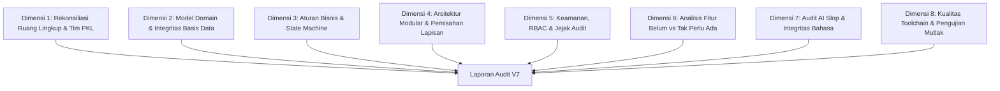

# RENCANA KERJA AUDIT OMNIKOMPREHENSIF V7
## SIM-INVENTARIS BPTI UHAMKA
**Dokumen Acuan:** `00-RECONCILIATION.md`, `03-domain-model.md`, `04-business-rules.md`, `05-state-machines.md`, `13-module-boundaries.md`, `17-data-dictionary.md`, `22-authorization-matrix.md`, `23-threat-model.md`, `32-traceability-matrix.md`, `AGENTS.md`, `AI_CODING_MASTER_RULES_CONSTRAINTS_CLEAN_VIBE_2026.md`, `Project_Charter_Sistem_Inventaris_BPTI_UHAMKA.md`, `SRS_Inventaris_BPTI_UHAMKA_Lengkap.md`, `stop-slop.md`  
**Target:** Penelusuran menyeluruh atas celah arsitektur, fitur yang belum diimplementasikan, fitur yang tak perlu diimplementasikan, dan keberadaan AI slop pada dokumentasi/kode.  
**Metodologi:** Bukti empiris langsung (`[VERIFIED-IN-CODE]`), uji statis (`tsc`, `eslint`), verifikasi pengujian dinamis (`vitest`), dan uji kompilasi produksi (`next build`).

---

## 1. Latar Belakang & Tujuan Audit V7

Setelah implementasi Tahap 1 hingga Tahap 4 (standardisasi identitas BPTI UHAMKA, kepatuhan Bcrypt 10 rounds, fitur impor massal, dan penegakan state machine), sistem membutuhkan audit menyeluruh level lanjut (V7). 

Audit V7 bertujuan untuk:
1. Memetakan kesenjangan fungsional dan teknis antara dokumen acuan resmi (Project Charter & SRS PKL) dengan implementasi nyata pada repositori `bpti-project-main`.
2. Menyusun katalog fitur website inventaris yang **belum diimplementasikan** (prioritas realistis untuk tim PKL).
3. Mengidentifikasi fitur yang **tidak perlu diimplementasikan** (out-of-scope / YAGNI / anti-overengineering) agar tim tidak terjebak dalam kompleksitas yang tidak relevan.
4. Mendeteksi dan membersihkan **AI slop** pada seluruh file dokumentasi markdown dan basis kode.

---

## 2. Struktur 8 Dimensi Penyelidikan Audit

---

## 3. Rincian Penyelidikan per Dimensi

### Dimensi 1: Rekonsiliasi Ruang Lingkup & Peran Tim PKL
* **Acuan:** `00-RECONCILIATION.md`, `Project_Charter_Sistem_Inventaris_BPTI_UHAMKA.md`, `SRS_Inventaris_BPTI_UHAMKA_Lengkap.md`.
* **Fokus Audit:**
  - Evaluasi keselarasan 4 anggota tim PKL:
    * Imam Maula (PM & Core Architect: Auth, Security, Database).
    * Indra Dharmawan (UI/UX & Frontend: Master Data Barang, Form CRUD).
    * Muhan Bintang (System Analyst & Fullstack Dev: Sirkulasi Peminjaman & SOP Logic).
    * Reval Delsiyano (QA/QC & Layout: Dashboard, Search, Filter, Testing).
  - Pengecekan konsistensi identitas institusi: Badan Pengembangan Teknologi Informasi (BPTI) UHAMKA, domain resmi `uhamka.ac.id`, peniadaan total entitas non-resmi (.go.id, Balai, Biro).
  - Penilaian kesiapan demo akhir PKL (tenggat 31 Oktober 2026).

### Dimensi 2: Model Domain & Integritas Basis Data
* **Acuan:** `prisma/schema.prisma`, `03-domain-model.md`, `17-data-dictionary.md`.
* **Fokus Audit:**
  - Audit struktur 19 model Prisma dan 9 enum.
  - Audit buku besar stok (`StockMovement` append-only, saldo turunan `Stock.quantity`, pelacakan saldo awal).
  - Deteksi kolom mati (dead fields) yang ada di skema tetapi tidak pernah dibaca/ditulis di kode aplikasi (misal `Stock.reservedQty`, `Location.type`).
  - Penegakan integritas referensial: `onDelete: Restrict` pada relasi master data ke transaksi, `SetNull` pada hierarki lokasi.
  - Audit koneksi driver adapter MariaDB dan konfigurasi pool koneksi Next.js.

### Dimensi 3: Aturan Bisnis & Mesin Status (Lifecycle)
* **Acuan:** `04-business-rules.md`, `05-state-machines.md`.
* **Fokus Audit:**
  - Penegakan BR-001 hingga BR-023:
    * BR-011: Larangan stok negatif untuk mutasi OUT dan TRANSFER.
    * BR-012: Penetapan kuantitas absolut pada mutasi ADJUSTMENT.
    * BR-013: Pembuatan otomatis `SystemAlert` saat stok menembus `minStock`.
    * BR-014 & BR-015: Penugasan aset hanya dari status `AVAILABLE` dan penanganan aset kembali berstatus `DAMAGED`.
    * BR-016: Guard tiket pemeliharaan (menolak aset `RETIRED`, `DISPOSED`, `LOST`, `IN_REPAIR`).
    * BR-017: Guard transfer lokasi aset (menolak aset `DISPOSED`, `RETIRED`, `LOST`).
    * BR-018: Transisi linier status pemeliharaan (`REQUESTED` -> `APPROVED` -> `IN_PROGRESS` -> `COMPLETED`/`CANCELLED`).
    * BR-020: Validasi berlapis: `requirePermission` -> validasi Zod -> transaksi atomik -> `recordAudit`.
    * BR-021: Prinsip *Zero Hard Delete* (tidak ada query `.delete()` / `.deleteMany()` pada entitas bisnis).
  - Alur peminjaman berjangka waktu (`AssetAssignment`): peminjam internal vs staf manual eksternal, `dueDate`, kalkulasi durasi, dan deteksi keterlambatan.

### Dimensi 4: Arsitektur Modular & Pemisahan Lapisan
* **Acuan:** `13-module-boundaries.md`, struktur direktori `src/`.
* **Fokus Audit:**
  - Evaluasi batas 8 modul: Identity & Access, Locations, Inventory, Assets, Maintenance, Monitoring, Reporting, Audit.
  - Kepatuhan Server-First Rule: Server Components sebagai default; Client Components hanya untuk interaksi form, modal, dan scanner.
  - Konsistensi Server Actions (`actions/*.ts`): format return `{ success, data, error }`, tidak melempar exception ke antarmuka klien.
  - Audit rute API Route Handlers: endpoint Better Auth, ekspor laporan, dan unduh template.

### Dimensi 5: Keamanan, RBAC & Jejak Audit
* **Acuan:** `22-authorization-matrix.md`, `23-threat-model.md`.
* **Fokus Audit:**
  - Penegakan RBAC sisi server: 6 peran dan 23 permissions.
  - Proteksi otorisasi jalur baca (Read-path authorization di seluruh 9 rute halaman).
  - Pertahanan terhadap IDOR / BOLA pada akses data individual.
  - Algoritma hashing kata sandi Bcrypt minimal 10 salt rounds (`NFR-SEC-01`).
  - Ketahanan cookie sesi Better Auth (`httpOnly`, signed session token).
  - Integritas jejak audit (`AuditLog`): kelengkapan pencatatan aktor, entitas, ID, before/after state, dan catatan mutasi.

### Dimensi 6: Analisis Fitur Sistem Inventaris
* **Fokus Audit:**
  - **Kategori 1: Fitur yang Sudah Terimplementasi & Reachable di UI**:
    * Dasbor analitik ringkasan metrik dan alert stok.
    * Katalog inventaris barang (kuantitas, filter, pagination).
    * Aset individual (serial number, tag, status, kondisi, QR code).
    * Sirkulasi penugasan/peminjaman aset dengan tanggal jatuh tempo.
    * Pengembalian aset dengan penilaian kondisi fisik.
    * Mutasi / transfer lokasi dan pemegang aset.
    * Pembuatan tiket pemeliharaan aset rusak.
    * Ekspor laporan dinamis (PDF dan Excel).
    * Impor massal data master via Excel/CSV.
    * Jejak audit aktivitas pengguna.
  - **Kategori 2: Fitur yang Sudah Ada di Service tetapi Belum Ada Antarmuka (Not UI-Reachable)**:
    * Antarmuka Manajemen Kategori (CRUD kategori mandiri).
    * Antarmuka Manajemen Departemen mandiri.
    * Tombol aktivasi/deaktivasi status pengguna (`User.isActive`).
    * Alur pembaruan status pemeliharaan oleh teknisi di UI (modal update tiket).
  - **Kategori 3: Fitur Inventaris Penting yang Belum Ada (Candidate Gaps)**:
    * Modul Stock Opname / Penyesuaian Fisik Berkala (Stock Reconciliation).
    * Antarmuka Pemantauan Keterlambatan Sirkulasi & Peringatan Tenggat Waktu Terpusat.
    * Cetak Bukti Berita Acara Serah Terima (BAST) Peminjaman/Pengembalian.
    * Riwayat Sirkulasi Per Pegawai / Peminjam.
  - **Kategori 4: Fitur yang TIDAK PERLU Diimplementasikan (Out-of-Scope / YAGNI)**:
    * Portal mandiri / publik untuk pegawai umum (Viewer role ditiadakan, akses satu pintu Admin).
    * Approval workflow bertingkat secara online (proses approval manual/fisik kantor).
    * Integrasi Single Sign-On (SSO) email kampus eksternal (sistem intranet lokal).
    * Endpoint telemetri monitoring beban hardware (CPU, RAM, utilisasi jaringan server).
    * Arsitektur Microservices / Message Broker / WebSocket kompleks yang melanggar batas modular monolith.

### Dimensi 7: Audit AI Slop & Integritas Penulisan
* **Acuan:** `.agents/rules/stop-slop.md`.
* **Fokus Audit:**
  - Pemindaian seluruh file markdown proyek (`README.md`, `SRS.md`, `00-32*.md`, file charter, dokumentasi arsitektur).
  - Deteksi kata pengisi (filler phrases), pembuka basa-basi (*throat-clearing*), dan adverbia berlebihan.
  - Penghapusan karakter em-dash (`—`) pada seluruh teks dokumen dan antarmuka.
  - Identifikasi klaim fiktif, metrik palsu (*hallucination*), atau perbandingan biner klise (*not X, but Y*).
  - Penerapan kalimat aktif dengan subjek manusia yang jelas.

### Dimensi 8: Kualitas Toolchain & Pengujian Mutlak
* **Fokus Audit:**
  - TypeScript compilation: `pnpm run typecheck` (`tsc --noEmit`).
  - ESLint verification: `pnpm run lint` (`eslint src/`).
  - Unit & Integration Test Suite: `pnpm test` (`vitest run`).
  - Production build generation: `npx next build`.

---

## 4. Rencana Langkah Eksekusi Audit

1. **Langkah 1: Pengumpulan Bukti Kode & Konfigurasi**:
   - Memindai database schema, service layer, Server Actions, route handlers, dan antarmuka UI.
   - Mengumpulkan bukti baris kode (`file:line`) untuk setiap kesenjangan.
2. **Langkah 2: Pemindaian AI Slop pada Berkas Teks & Dokumentasi**:
   - Menjalankan pencarian teks berpola slop (em-dash, kata klise AI, passive voice).
3. **Langkah 3: Analisis Fitur Inventaris & Klasifikasi Scope**:
   - Memisahkan fitur in-scope terpasang, in-scope belum berantarmuka, candidate backlog, dan out-of-scope definitif.
4. **Langkah 4: Penyusunan Laporan Lengkap GAP AUDIT REPORT V7**:
   - Menyusun dokumen laporan komprehensif, terstruktur, berbasis bukti, dan bebas slop.
5. **Langkah 5: Verifikasi Ulang Kualitas Kode & Rekomendasi Tindak Lanjut**.
